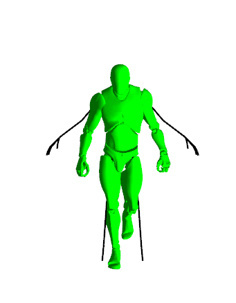
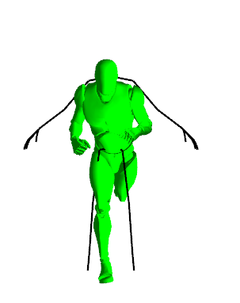
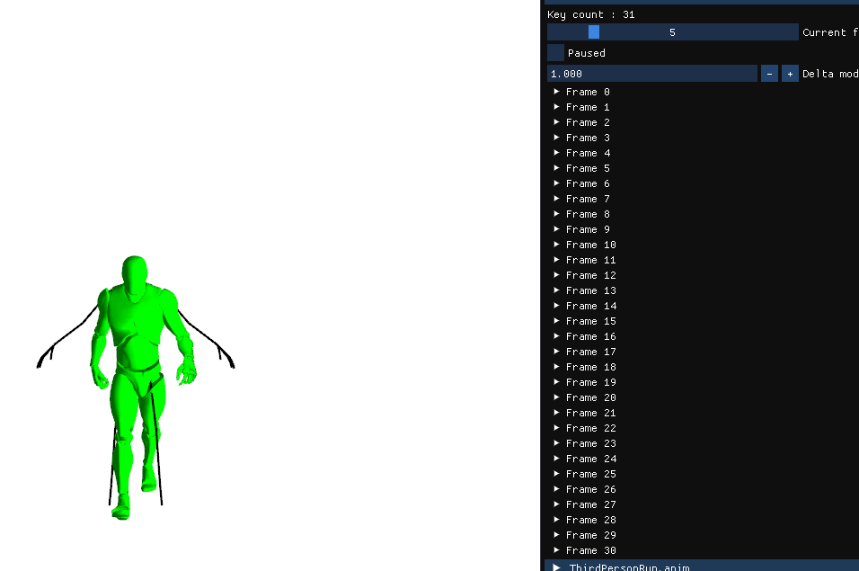
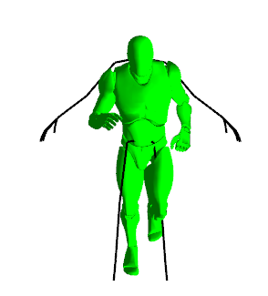
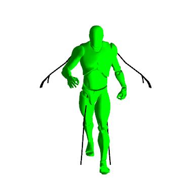

# Animation programming

- [Animation programming](#animation-programming)
  - [Screenshots](#screenshots)
  - [Project](#project)
- [x86](#x86)
    - [Skeleton loading](#skeleton-loading)
    - [Animation loading](#animation-loading)
    - [Animation playing](#animation-playing)
    - [Animation montage](#animation-montage)
    - [Animation cross fade](#animation-cross-fade)
    - [Animation mixed play](#animation-mixed-play)
    - [ImGui](#imgui)
- [x64](#x64)
    - [GLTF loading](#gltf-loading)

## Screenshots

## Project

The project actually contains 2 projects, you can switch between them by changing between x64 and x86.
- x86, uses the "official" engine provided and has the features
- x64, custom engine that was intended to load custom models and animations, unfortunately it could not be finished in time (only allows custom gltf model loading).

# x86

### Skeleton loading
The default skeleton is loaded with a its full hierarchy.

### Animation loading
Each animation is loaded and is bound to the loaded skeleton.

### Animation playing
An animation can be played with a custom speed, the speed can even be negative, which plays the animation backwards.
The animation is interpolated between frames, which makes it smooth whatever the speed is.

### Animation montage
An animation montage is a list of commands executed in order, one after the other can creates a full animation.
The commands are :
- Play animation
- Wait
- Cross fade between two animation
- Play mixed between 2 animations

### Animation cross fade
The cross fade allows to smoothly interpolated between 2 animations, it's part of an animation montage command.

### Animation mixed play
The mixed play allows to constantly interpolate between 2 animations based on a 0;1 value.

### ImGui
Another (hidden) window on another thread is used to provide ImGui, allowing to edit some values, bu mostly to view info about the skeleton and the animations.

# x64

### GLTF loading
A gltf file can be partially loaded (header, vertices, indices, texture, uvs) and used.
